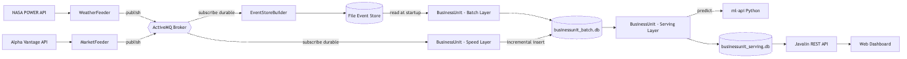
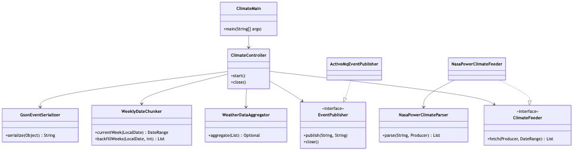
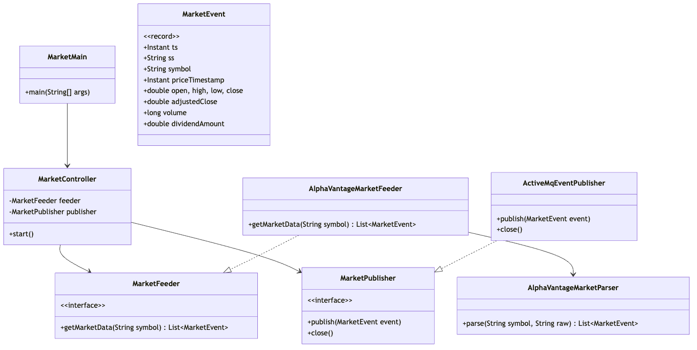
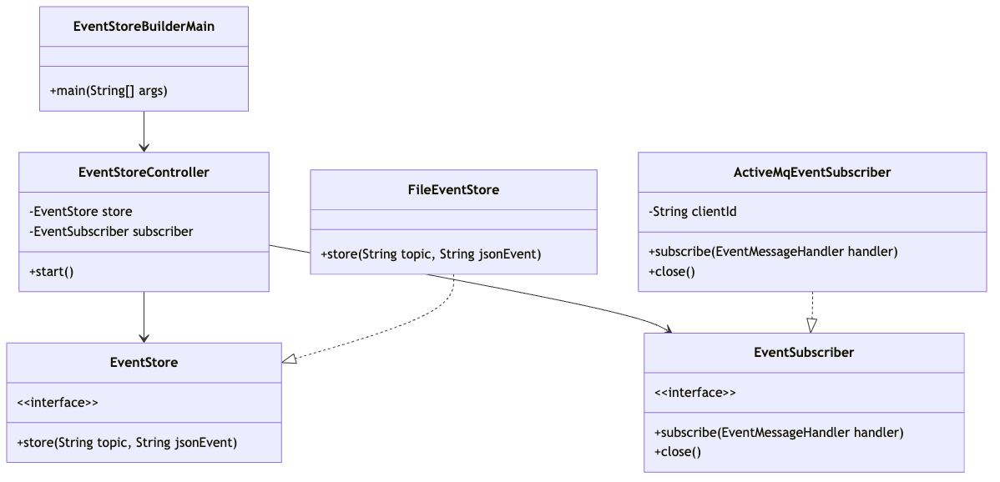
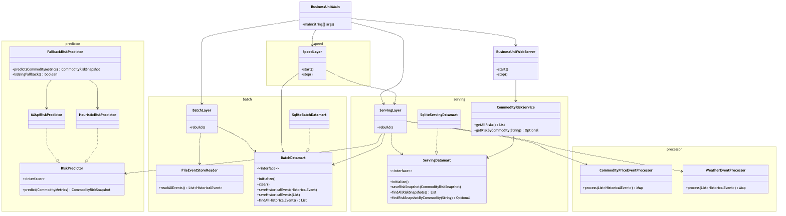

# OrbitalAlpha

Event-driven commodity risk analysis system for agricultural markets. Combines real-time climate data from NASA POWER with weekly commodity ETF prices from Alpha Vantage to predict supply-chain risk levels for wheat, corn, soybeans, coffee, and natural gas.

## Value proposition

Agricultural commodity prices are sensitive to weather conditions. A drought, a heat wave, or a drop in soil moisture can trigger price spikes weeks later. OrbitalAlpha captures both data streams, correlates them through a Lambda Architecture, and surfaces actionable risk predictions via a REST API and a web dashboard, helping analysts spot emerging risks before they hit the market.

## Why these APIs

| API | Reason |
|---|---|
| **NASA POWER** | Free, no API key required, provides daily agrometeorological parameters (precipitation, root-zone soil wetness, temperature min/max) at any coordinate worldwide. Data varies over time — ideal for tracking evolving weather conditions that affect crop yields. |
| **Alpha Vantage** | Free tier with weekly adjusted time series for commodity ETFs (WEAT, CORN, SOYB, JO, UNG). Provides OHLCV + adjusted close + dividends. Weekly granularity matches the natural rhythm of agricultural supply/demand cycles. |

Both sources are dynamic (new data every week), complementary (weather causes → market effects), and accessible without authentication barriers.

---

## System architecture



### Lambda Architecture inside `businessunit`

```
File Event Store ──► Batch Layer ──► businessunit_batch.db
                                           │
ActiveMQ ──► Speed Layer ──► (incremental  │
                              insert)──────┘
                                           │
                                           ▼
                                     Serving Layer
                                           │
                               ┌───────────┼───────────┐
                               ▼                       ▼
                        MlApiRiskPredictor    HeuristicRiskPredictor
                        (primary, HTTP)           (fallback)
                               │                       │
                               └───────────┬───────────┘
                                           ▼
                                 businessunit_serving.db
                                           │
                                           ▼
                                  Javalin REST API + Frontend
```

- **Batch Layer**: On startup, reads ALL historical events from the file event store, clears and rebuilds `businessunit_batch.db`.
- **Speed Layer**: Subscribes durably to ActiveMQ. When a new event arrives, it inserts it incrementally into `businessunit_batch.db` (no full rebuild) and schedules a debounced serving layer rebuild.
- **Serving Layer**: Reads from `businessunit_batch.db`, runs processors to compute metrics, calls the ML predictor, and writes risk snapshots to `businessunit_serving.db`.

### Two datamarts

| Datamart | File | Purpose |
|---|---|---|
| Batch | `businessunit_batch.db` | Historical events, rebuilt from file event store at startup, updated incrementally by speed layer |
| Serving | `businessunit_serving.db` | Latest risk snapshots per commodity, optimized for API/frontend queries |

### ML-first prediction with heuristic fallback

`businessunit` calls `ml-api` via HTTP for each commodity risk prediction. If `ml-api` is unavailable, `FallbackRiskPredictor` automatically switches to `HeuristicRiskPredictor`. The frontend and `GET /api/status` indicate when fallback is active.

---

## Class diagrams

### weatherfeeder



### marketfeeder



### eventstorebuilder



### businessunit



---

## Design principles and patterns

| Pattern / Principle | Where applied | Purpose |
|---|---|---|
| **Strategy** | `RiskPredictor` interface with `MlApiRiskPredictor` and `HeuristicRiskPredictor` | Swap prediction algorithms without changing the serving layer |
| **Observer / Pub-Sub** | ActiveMQ topics with feeders as publishers and EventStoreBuilder/BusinessUnit as subscribers | Decouple data producers from consumers |
| **Lambda Architecture** | `batch/`, `speed/`, `serving/` packages inside `businessunit` | Combine batch accuracy with real-time freshness |
| **MVC** | Each module: `model/` (domain), `controller/` (logic), `view/` (API/UI) | Separate concerns within each module |
| **Dependency Inversion (DIP)** | `EventStore`, `EventSubscriber`, `BatchDatamart`, `ServingDatamart`, `RiskPredictor` are all interfaces | High-level modules depend on abstractions, not implementations |
| **Single Responsibility (SRP)** | Processors only parse/aggregate; predictors only predict; datamarts only persist | Each class has one reason to change |
| **Open/Closed (OCP)** | New risk predictors can be added by implementing `RiskPredictor` without modifying `ServingLayer` | Extend behavior without modifying existing code |
| **Graceful Degradation** | `FallbackRiskPredictor` wraps primary + fallback with automatic switch | System remains functional when ml-api is down |
| **Debouncing** | `SpeedLayer` schedules serving rebuilds with a 5-second delay | Prevent excessive rebuilds when multiple events arrive in quick succession |
| **Durable Subscriptions** | Both `eventstorebuilder` and `businessunit` use JMS durable subscribers with clientID | No message loss if a subscriber restarts |

---

## System requirements

- **Java 21** (OpenJDK or equivalent)
- **Maven 3.8+**
- **Python 3.11+** with pip
- **Apache ActiveMQ Classic 6.x** (standalone or Docker)
- **Internet access** for NASA POWER and Alpha Vantage APIs

---

## Installation and configuration

### 1. Clone the repository

```bash
git clone https://github.com/Xami650/OrbitalAlpha.git
cd OrbitalAlpha
```

### 2. Install and start ActiveMQ

**Option A — Native install (macOS):**

```bash
brew install activemq
activemq console
```

**Option B — Docker:**

```bash
docker run -d --name activemq \
  -p 61616:61616 \
  -p 8161:8161 \
  apache/activemq-classic:latest
```
**Option C — Native install (Windows):**

1. Download **Apache ActiveMQ Classic 6.x** from the official website:

   https://activemq.apache.org/components/classic/download/

2. Extract the `.zip` file to a simple path, for example:

   ```text
   C:\tools\apache-activemq-6.2.4
   ```
   Avoid paths with accents, special characters, or very long directory names.

3. Make sure Java is installed and `JAVA_HOME` is configured.

   Example:

   ```text
   JAVA_HOME=C:\Program Files\Java\jdk-21
   ```
   
   Verify it with:
   
   ```bash
   java -version
   echo %JAVA_HOME%
   ```

5. Open **Command Prompt** or **PowerShell** and go to the ActiveMQ `bin` folder:

   ```bash
   cd C:\tools\apache-activemq-6.2.4\bin
   ```

   If your extracted folder contains another nested folder, the path may be similar to:

   ```bash
   cd C:\tools\apache-activemq-6.2.4-bin\apache-activemq-6.2.4\bin
   ```

6. Start ActiveMQ in console mode:

   ```bash
   activemq.bat console
   ```

   If you are using PowerShell, run:

   ```bash
   .\activemq.bat console
   ```

7. Verify that ActiveMQ is running:

   - Broker URL: `tcp://localhost:61616`
   - Web console: `http://localhost:8161`
   - Default user: `admin`
   - Default password: `admin`

8. Keep this terminal open while running the Java modules.

   The project modules that publish or consume events require ActiveMQ to be running before they start.


   Verify: open `http://localhost:8161` (user: `admin`, password: `admin`).

### 3. Configure modules

```bash
# MarketFeeder: copy template and add your Alpha Vantage API key
cp marketfeeder/src/main/resources/marketfeeder.example.properties \
   marketfeeder/src/main/resources/marketfeeder.properties
# Edit marketfeeder.properties → set api.key=YOUR_KEY

# EventStoreBuilder: copy template
cp eventstorebuilder/src/main/resources/eventstorebuilder.example.properties \
   eventstorebuilder/src/main/resources/eventstorebuilder.properties
```

> `businessunit/src/main/resources/businessunit.properties` and `weatherfeeder/src/main/resources/application.properties` ship with working defaults.

### 4. Build

```bash
mvn clean package -DskipTests
```

---

## Execution procedure

### Initial data load (first time only)

To build a meaningful risk model you need historical data. Follow this sequence:

#### Step 1 — Start ActiveMQ and EventStoreBuilder

```bash
# Terminal 1
activemq console

# Terminal 2
mvn exec:java -pl eventstorebuilder
```

#### Step 2 — Backfill market data (104 weeks)

Edit `marketfeeder/src/main/resources/marketfeeder.properties`:

```properties
max.weeks=104
```

Run the market feeder once:

```bash
# Terminal 3
mvn exec:java -pl marketfeeder
```

Wait for one cycle to complete (you will see log lines for each symbol). Then stop with `Ctrl+C`.

Change `max.weeks` back to `1` for normal weekly operation:

```properties
max.weeks=1
```

#### Step 3 — Backfill weather data (104 weeks)

Edit `weatherfeeder/src/main/resources/application.properties`:

```properties
weather.mode=BACKFILL
weather.backfill.weeks=104
```

Run the weather feeder once:

```bash
# Terminal 3
mvn exec:java -pl weatherfeeder
```

Wait for the backfill to complete (logs will show block-by-block progress). Then stop with `Ctrl+C`.

Switch to weekly mode for normal operation:

```properties
weather.mode=WEEKLY
weather.backfill.weeks=4
```

#### Step 4 — Train the ML model

```bash
cd ml-api
python3 -m venv .venv
source .venv/bin/activate
pip install -r requirements.txt

# Generate training data from the batch datamart
python generate_dataset.py --db-path ../businessunit_batch.db

# Train the model
python train_model.py

# Start the API
uvicorn app:app --port 8000
```

Verify:

```bash
curl http://localhost:8000/health
# → {"status":"OK","modelLoaded":true}
```

#### Step 5 — Start BusinessUnit

```bash
# Terminal 4 (from project root)
mvn exec:java -pl businessunit
```

Open `http://localhost:7070` in a browser to see the dashboard.

### Normal daily operation

Once the initial load is done, start all services:

```bash
# Terminal 1: ActiveMQ
activemq console

# Terminal 2: EventStoreBuilder
mvn exec:java -pl eventstorebuilder

# Terminal 3: ml-api
cd ml-api && source .venv/bin/activate && uvicorn app:app --port 8000

# Terminal 4: BusinessUnit
mvn exec:java -pl businessunit

# Terminal 5: Feeders (run on their own schedule)
mvn exec:java -pl marketfeeder
mvn exec:java -pl weatherfeeder
```

Or use the convenience script:

```bash
./start.sh
# Starts ml-api, EventStoreBuilder, and BusinessUnit.
# Feeders run separately in their own terminals.
```

---

## REST API

### Endpoints

| Method | Path | Description |
|---|---|---|
| `GET` | `/api/health` | Health check |
| `GET` | `/api/status` | ML API availability |
| `GET` | `/api/risks` | All commodity risk snapshots |
| `GET` | `/api/risks/{commodity}` | Single commodity risk snapshot |

**Frontend:** http://localhost:7070

**ml-api:** http://localhost:8000

### Examples

```bash
# Health check
curl http://localhost:7070/api/health
```
```json
{"status":"OK"}
```

```bash
# ML status
curl http://localhost:7070/api/status
```
```json
{"mlAvailable":true}
```

```bash
# All risks
curl http://localhost:7070/api/risks
```
```json
[
  {
    "commodity": "CORN",
    "riskLevel": "LOW",
    "riskScore": 10.0,
    "reason": "LOW risk: market and weather indicators remain stable."
  },
  {
    "commodity": "WEAT",
    "riskLevel": "MEDIUM_HIGH",
    "riskScore": 70.0,
    "reason": "MEDIUM_HIGH risk due to moderate price increase, low root-zone soil wetness."
  }
]
```

```bash
# Single commodity
curl http://localhost:7070/api/risks/WEAT
```
```json
{
  "commodity": "WEAT",
  "riskLevel": "MEDIUM_HIGH",
  "riskScore": 70.0,
  "reason": "MEDIUM_HIGH risk due to moderate price increase, low root-zone soil wetness."
}
```

```bash
# ml-api prediction
curl -X POST http://localhost:8000/predict \
  -H "Content-Type: application/json" \
  -d '{
    "commodity": "WEAT",
    "priceChangePercent": 6.5,
    "precipitation": 0.2,
    "rootZoneSoilWetness": 0.28,
    "temperatureMax": 34.0,
    "temperatureMin": 18.0,
    "priceVolatility": 3.0,
    "priceTrend": 2.0,
    "precipitationDelta": -1.0,
    "soilWetnessDelta": -0.1,
    "temperatureMaxDelta": 2.0
  }'
```
```json
{
  "commodity": "WEAT",
  "riskLevel": "HIGH",
  "riskScore": 90.0,
  "reason": "HIGH risk due to strong price increase, low precipitation, low root-zone soil wetness, high maximum temperature."
}
```

---

## Event store format

Events are stored as JSON Lines (NDJSON) in the file system:

```
eventstore/{topic}/{ss}/{YYYYMMDD}.events
```

- `{topic}`: ActiveMQ topic name (`CommodityPrice`, `Weather`)
- `{ss}`: source system identifier (`AlphaVantage`, `weatherfeeder`)
- `{YYYYMMDD}`: date derived from the `ts` field in UTC

Example directory structure:

```
eventstore/
├── CommodityPrice/
│   └── AlphaVantage/
│       └── 20260519.events
└── Weather/
    └── weatherfeeder/
        └── 20260519.events
```

### Sample CommodityPrice event

```json
{"ts":"2026-05-19T13:40:02.401978Z","ss":"AlphaVantage","symbol":"WEAT","priceTimestamp":"2026-05-18T00:00:00Z","open":24.78,"high":25.115,"low":24.65,"close":25.0,"adjustedClose":25.0,"volume":1422909,"dividendAmount":0.0}
```

### Sample Weather event

```json
{"ts":"2026-05-19T13:43:16.872328Z","ss":"weatherfeeder","producerId":"WHEAT_1","producerName":"Beauce - France","commodityType":"WHEAT","periodStart":"20260513","periodEnd":"20260519","daysUsed":4,"avgPrecipitation":2.4525,"avgRootZoneSoilWetness":0.6,"avgTemperatureMax":13.975,"avgTemperatureMin":5.2425}
```

Full multi-event sample files are available in [`docs/samples/`](docs/samples/):

- [`CommodityPrice-sample.events`](docs/samples/CommodityPrice-sample.events) — 5 commodity ETF price events
- [`Weather-sample.events`](docs/samples/Weather-sample.events) — 5 weather aggregation events

---

## Datamart schemas and sample data

### Batch datamart (`businessunit_batch.db`)

```sql
CREATE TABLE historical_events (
    id            INTEGER PRIMARY KEY AUTOINCREMENT,
    topic         TEXT NOT NULL,
    source_system TEXT NOT NULL,
    file_date     TEXT NOT NULL,
    raw_json      TEXT NOT NULL
);
```

### Serving datamart (`businessunit_serving.db`)

```sql
CREATE TABLE commodity_risk_snapshots (
    commodity  TEXT PRIMARY KEY,
    risk_level TEXT NOT NULL,
    risk_score REAL NOT NULL,
    reason     TEXT NOT NULL
);
```

Sample datamart content with example rows: [`docs/samples/datamart-sample.md`](docs/samples/datamart-sample.md)

---

## ML training pipeline

```
eventstore ──► businessunit_batch.db ──► generate_dataset.py ──► training_dataset.csv ──► train_model.py ──► commodity_risk_model.pkl
```

- **generate_dataset.py**: Extracts features from `businessunit_batch.db`, crosses price history with three weather scenarios (benign, moderate, adverse using real observed extremes), and assigns risk labels using the same domain rules as `HeuristicRiskPredictor` (bootstrap labeling).
- **train_model.py**: Trains a `RandomForestClassifier` (200 trees, max depth 12, balanced class weights) with `StandardScaler` preprocessing. Prints accuracy, classification report, confusion matrix, and feature importances.
- **app.py**: FastAPI service that loads the trained model and exposes `GET /health` and `POST /predict`. Generates transparent, rule-based reason strings explaining each prediction.

---

## Running tests

```bash
# All Java modules (167 tests)
mvn clean test

# Single module
mvn test -pl businessunit
mvn test -pl weatherfeeder
mvn test -pl marketfeeder
mvn test -pl eventstorebuilder

# Python ml-api tests
cd ml-api
source .venv/bin/activate
pip install -q pytest httpx
python -m pytest test_app.py -v
```

---

## Module summary

| Module | Language | Role |
|---|---|---|
| `weatherfeeder` | Java | Polls NASA POWER weekly and publishes aggregated weather events to ActiveMQ topic `Weather` |
| `marketfeeder` | Java | Polls Alpha Vantage weekly and publishes commodity price events to ActiveMQ topic `CommodityPrice` |
| `eventstorebuilder` | Java | Subscribes durably to ActiveMQ and appends events to the file-based event store |
| `businessunit` | Java | Lambda Architecture: batch, speed, serving layers; SQLite datamarts; Javalin REST API; web dashboard |
| `ml-api` | Python | FastAPI service with RandomForest model for commodity risk prediction |

---

## Git hygiene

Generated files excluded from the repository (see `.gitignore`):

- `*.db` — SQLite datamarts (regenerated at runtime)
- `*.pkl` — ML model files (run `python train_model.py` to regenerate)
- `.venv/` — Python virtual environment
- `__pycache__/`
- `target/` — Maven build output
- `eventstore/` — event store files (generated by running feeders + EventStoreBuilder)
- `*.properties` — config files with API keys (except `businessunit.properties` and `application.properties` which have safe defaults)
